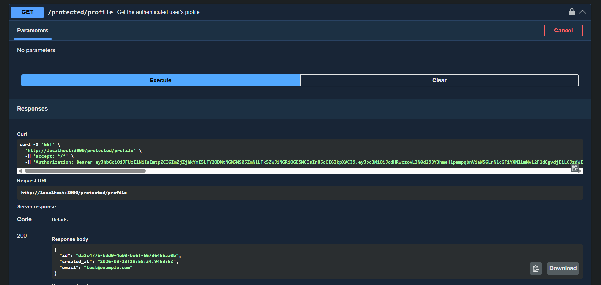

# Auth - Login & protect (W4.A4)

A to-do list API built with Express and TypeScript, full CRUD backed by containerized PostgreSQL, and now secured with Supabase Auth: sign up, log in, log out, and route-level protection via verified JWTs. Built for the FlyRank Backend Internship, Week 4, Assignment A4.

## What this is

On top of the existing task CRUD API, this adds:

- **Sign up** and **log in** via Supabase Auth (email + password)
- **JWT verification** on protected routes, no request reaches protected logic without a valid, unexpired token
- **Reusable auth middleware** one guard function protects any route it's applied to
- **Log out**
- A clear split between **public** routes (open to anyone) and **protected** routes (require a valid bearer token)

Supabase handles all password hashing and token signing, this project never touches a raw password or implements any cryptography itself.

## How to run it

```bash
git clone https://github.com/RonydaEssam/FlyRank-Assignments
cd assignments/BE-04

cp .env.example .env
# then fill in your own Supabase project URL, anon key, and DB connection string in .env

docker compose up
```

The API is available at `http://localhost:3000`.

## Setting up your own Supabase project

1. Create a free project at [supabase.com](https://supabase.com)
2. In **Project Settings → API**, copy your **Project URL** and **`anon` public key** (never the `service_role` key)
3. In **Authentication → Sign In / Providers → Email**, turn off "Confirm email" for local testing (a fresh signup can then log in immediately without clicking an email link)
4. Paste your URL and key into `.env` (see `.env.example` for the required keys)

## Environment variables

```
SUPABASE_URL=your_project_url
SUPABASE_KEY=your_anon_key
PORT=3000
DATABASE_URL=postgres://postgres:dev@db:5432/tasks
```

`.env` is git-ignored and never committed. `.env.example` holds the same keys with placeholder values.

> **Security note:** Supabase keys leaked to a public repo get scraped by bots within minutes. Double-check `.env` never appears in `git log` before pushing.

## Endpoints

| Method | Route | Auth required | Description | Success | Errors |
|--------|-------|:---:|-------------|---------|--------|
| POST | `/auth/signup` | No | Create a new account | 201 | 400 missing fields |
| POST | `/auth/login` | No | Log in, get access + refresh tokens | 200 | 400 missing fields, 401 invalid credentials |
| POST | `/auth/logout` | **Yes** | End the session | 204 | 401 missing/invalid token |
| GET | `/public/info` | No | Open, public data | 200 | — |
| GET | `/protected/profile` | **Yes** | Authenticated user's profile | 200 | 401 missing/invalid token |
| GET | `/protected/dashboard` | **Yes** | Example second protected route (same guard) | 200 | 401 missing/invalid token |
| GET | `/tasks`, etc. | No | Existing CRUD task endpoints (see A1–A3) | — | — |

Protected routes expect `Authorization: Bearer <access_token>`.

## Example: full auth flow

```bash
# 1. Sign up
curl -i -X POST http://localhost:3000/auth/signup \
  -H "Content-Type: application/json" \
  -d '{"email":"test@example.com","password":"password123"}'

# 2. Log in
curl -i -X POST http://localhost:3000/auth/login \
  -H "Content-Type: application/json" \
  -d '{"email":"test@example.com","password":"password123"}'
# copy the access_token from the response

# 3. Access a protected route
curl -i http://localhost:3000/protected/dashboard \
  -H "Authorization: Bearer <ACCESS_TOKEN>"
```

```
HTTP/1.1 200 OK
X-Powered-By: Express
Content-Type: application/json; charset=utf-8
Content-Length: 57
ETag: W/"39-6WG7m4yy1hTqV3npbqlr5sLDFX8"
Date: Sat, 29 Aug 2026 17:55:04 GMT
Connection: keep-alive
Keep-Alive: timeout=5

{"message":"Welcome to your dashboard, test@example.com"}
```

## Swagger UI

Interactive docs are served at `/docs`. Protected routes show a lock icon, click **Authorize**, paste an access token, and use "Try it out" directly from the browser.



## Tech stack

- TypeScript, Express
- Supabase Auth (`@supabase/supabase-js`): identity provider, JWT issuing and verification
- PostgreSQL 16 in Docker: task storage (unrelated to auth; see A3)
- Docker + Docker Compose
- swagger-ui-express + OpenAPI (YAML), with a `bearerAuth` security scheme

## How the auth flow works

1. Client sends email/password to `/auth/signup` or `/auth/login`, these forward directly to Supabase, which hashes/checks the password and returns a signed JWT.
2. Client attaches that JWT to future requests: `Authorization: Bearer <token>`.
3. Protected routes run through `requireAuth` middleware first, which asks Supabase (`supabase.auth.getUser(token)`) whether the token is genuinely valid, this is a real network call, so a tampered or expired token is caught immediately.
4. Only if Supabase confirms the token does the middleware call `next()` and let the actual route handler run, with the verified user attached to `req.user`.

This project never stores, hashes, or verifies passwords itself, that's Supabase's job entirely.

## Notes

**A1 → A2 → A3 → A4:** the task CRUD endpoints and their storage (Postgres in Docker) are unchanged from A3. This assignment adds an entirely separate concern (authentication) on top, without touching the existing task logic. The one new architectural piece, the `requireAuth` middleware, is reusable across any future protected route with zero duplicated code.
